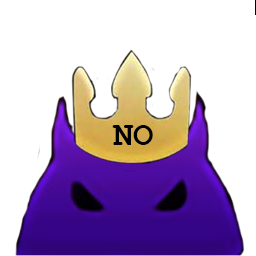

# はじめに

Deep Dungeon Overlay (DDO) と DDO Target Info (DDOTI) は開発中の OverlayPlugin スキンで、FF14 のディープダンジョンに一人でプレイしているときに、リアルタイムで情報を提供することを目的としています。

| |  |
| :-: | :-: |
| |  |

# DDO / DDOTI使用の要件

DDOにはAdvanced Combat Tracker ([ACT](https://advancedcombattracker.com/)) というソフトウェアが必要です。 また、ACTには [FFXIV_ACT_Plugin](https://github.com/ravahn/FFXIV_ACT_Plugin) と [OverlayPlugin](https://github.com/ngld/OverlayPlugin) のライブラリがインストールされている必要があります。

ACTおよびFFXIV_ACT_Pluginのインストール方法は、こちらに記載されています。 [ACTのセットアップガイド](https://github.com/FFXIV-ACT/setup-guide)

また、Desperius FFXIVには良い動画チュートリアル(英語)があります（2021年4月現在の情報です） [動画ガイド](https://www.youtube.com/watch?v=urZTrF864x8&t=0s)

# Localization

現在、DDOは英語、フランス語、日本語、ドイツ語をサポートしています。  _敵情報の備考は日本語と英語のみサポートされています。_ 
* フランス語の翻訳とサポートは [Coccis77](https://twitter.com/Coccis77)が担当しています。
* 日本語の翻訳とサポートは [Chiela](https://twitter.com/HurricaneChiela)が担当しています。また、[配信](https://www.twitch.tv/hurricanechiela)もあります。
* ドイツ語の翻訳とサポートは [Tancred](https://twitter.com/Tancred423)が担当しています。

 _注意:_ サポートされている言語を使用するには、*ゲームクライアント*とFFXIV_ACT_Pluginの*Game Language*の両方を適切な言語に設定する必要があります。

# DDO / DDOTIのインストール
[インストールマニュアル](overlay/docs/ja/INSTALL_JA.md)をご覧ください。
* [Instructions d'installation](overlay/docs/fr/INSTALL_FR.md)  
* [Installation Instructions](overlay/docs/en/INSTALL.md)

# 配信者向けセットアップ

[配信者向けインストールマニュアル(英語)](overlay/docs/en/STREAMER.md)をご覧ください。

# 現在の機能

* スコア (推定)
	* オーバーレイには、現在のスコアの推定値がリアルタイムで表示されます。 詳細はこちら [Score Details](https://github.com/IAmLokken/DeepDungeonOverlay#scoring-details)
	* スコアの計算式はAlpha's scoring testingから算出しています。 [Scoring explanation](https://docs.google.com/document/d/1MnR2Xtj2lol1LESgscI6yi_1xcAeP3FBwJecbD-EiwE/edit)
	 
* 土器
	* 呪印解除 (現在の階で使用している場合有効)
	* サイトロ (現在の階で使用している場合有効)
	* 宝箱増加 (直前の階で使用している場合有効)
	* 敵変化 (直前の階で使用している場合有効)
	* 敵排除 (直前の階で使用している場合有効)

* 統計
	* 敵を倒した数
	* ミミック(コリガン)を倒した数
	* 罠を踏んだ数
	* 宝箱を開けた数
	* Floor enchantments applied (using a Serenity will decrement this count)
	* レアモンスターの数(死者の宮殿のみ)
	* 30分以内に10階層をクリアした回数

* 敵情報
    * 敵の名前
	* 敵のHP割合
	* 敵の危険度
		簡単 | 注意 | 危険 | 無理
		:-: | :-: | :-: | :-: 
		 |  |  | 
	* 敵の感知タイプ	
		視覚 | 聴覚 | 接近
		:-: | :-: | :-:
		 |  | 
	* 備考(敵について知っておくべきこと)
	* __全ての敵情報はMaygiのDDハンドブックから許可を得て引用しています__.
	 	* Follow Maygi on [Twitch](https://www.twitch.tv/maygii), [Twitter](https://twitter.com/MaybeMaygi), and [Youtube](https://www.youtube.com/c/Maygi).
		* [PotD Handbook](https://docs.google.com/document/d/e/2PACX-1vQpzFuhmSwTXuZSmtnKLNgQ0nRhumCFaB8NvCXFXSjrBHPRT5lXY8jMR4RaCK1aNfcl_G5ph5DNNwfl/pub)
		* [HoH Handbook](https://docs.google.com/document/d/1YVBSTOgJO-xOAB6YyKZEZRikjXFPle6Ihf_E7VdmQnI/edit)
		* Additional mob aggro types tested with the help of Cloudburst's status spreadsheets [PotD](https://docs.google.com/spreadsheets/d/1nKI0-AApj-aiuUimrPkuQUJaa4DU8Ox7KqdC_ibme8E/edit#gid=12879293), [HoH](https://docs.google.com/spreadsheets/d/1aDlsiN3At6Fvfj_gg5weucDYqjQawQxGHFhJvzEUrek/edit#gid=375717345)
	* **NOTE**: Bestiary information is the only section availble during group runs.
	* **NOTE**: 敵情報が無かったり、欠けている場合は [Issue](https://github.com/IAmLokken/DeepDungeonOverlay/issues)を作成してください

スコア、土器、統計、敵情報はオーバーレイのチェックボックスで表示・非表示を切り替えることが出来ます

 

# Save Files

DDO saves relevant information about the current run to the OverlayPlugin config file.

There are some caveats to be aware of when doing runs you want to track and having them saved:
* DDO will be unable to discern identical save files once the player has exited the deep dungeon instance (i.e. the floors or the inbetween floor areas) or closes FFXIV or ACT.
* Two save files are identical if:
	* Both are for the same deep dungeon.
	* Both are on the same character.
	* Both are on the same job. 
	* Both are on the same floor.

An example case of this is if you like to build two save files up to the same floor (i.e. two save files at floor 171 for RDM on the same character).  
When selecting the save slot in game the overlay does not have a way to know _which_ save file you clicked on and will just pick the first one it finds in its own save file that matches on dungeon, character, job, and floor.  Since there are two it may not pick the right one and the tracked data will be innacurate.
This is only an issue if you leave the dungeon instance with both save slots at the same floor.  If you continue one save slot past where another is currently at the overlay will not have an issue.

Since the overlay does not know when you delete a save file in game there are two buttons to clear its save files of any saves when not in a deep dungeon.  This is good to use when you plan on attempting a run that you want to make sure is properly tracked.

# Scoring Details

The score estimate you see when you start a run proactively assumes a few things in order to keep the displayed score as accurate as possible:
* You have max aetherpool (99/99).
* You are max level (60/70).
* You will successfully complete the current run to the next scorecard (30/100/200).
	
Speed run bonus is credited at the start of a floorset and removed if the '30 minutes remaining' message is detected.

Full points for floor reveal are credited at the start of a floor (if the 'assume full map clear' option is enabled).

A point estimate depending on the dungeon/floorset is added per room revealed (if the 'assume full map clear' option is disabled) unless:
* A Pomander of Sight is used. Full points are awarded.
* Total number of revealed rooms equals the maximum possible rooms for the current dungeon/floorset. Full points are awarded.
* Total number of revealed rooms is less than the minimum possible rooms for the current dungeon/floorset.  No points are awarded.

Magicite can kill monsters that are so far away from the player that they have not been loaded on their machine.  This means when they die no death notification is received.  As a result the kill count will be innacurate.

The score will display '414' if the run did not start on 1, 21 (HoH) or 51 (PotD).

# In Development

* An upgrade to the UI/UX is being worked on to improve readability and streamline the current implementation.
* The scoring algorithm is continuously being tweaked and tested.
