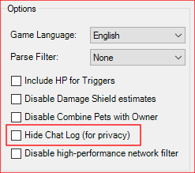
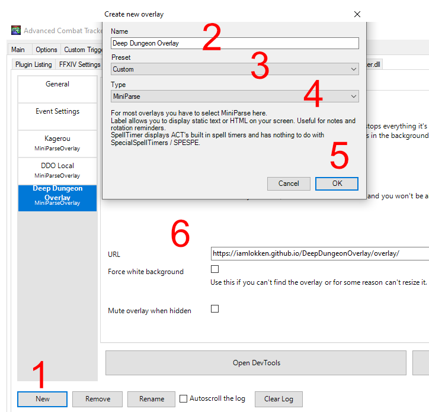

# Avertissement

L'option _Hide Chat Log (for privacy)_ du plugin FFXIV ACT doit être désactivée. L'overlay a besoin de lire les lignes du chat pour fonctionner.

Cette option se trouve dans l'onglet *FFXIV Settings*, dans le groupe *Options*.

# Installer l'Overlay

1. Dans la fenêtre de l'OverlayPlugin, appuyez sur le bouton ['New'] pour créer un nouvel overlay.
2. Donnez le nom que vous désirez à l'overlay.
3. Choisissez 'Custom' dans la liste de Preset.
4. Choisissez 'Miniparse' dans la liste de Type.
5. Validez avec OK.
6. Dans URL, insérez ... https://iamlokken.github.io/DeepDungeonOverlay/overlay/

	
	
- Certaines descriptions d'ennemis peuvent déborder de la fenêtre de l'overlay. Il est donc conseillé de la redimensionner à votre convenance.
	- Dans l'OverlayPlugin, cochez 'Force white background' situé sous URL.
	- Redimensionnez la fenêtre pour faire correspondre au ratio de l'image ci-dessous.
	- Décochez Fin de l'installation.Force white background'.

	
	
	
	 
	
	Fin de l'installation.
	
	Retour au [README](../README.md)
  
  
  Traduction par [Coccis77](https://twitter.com/Coccis77).
