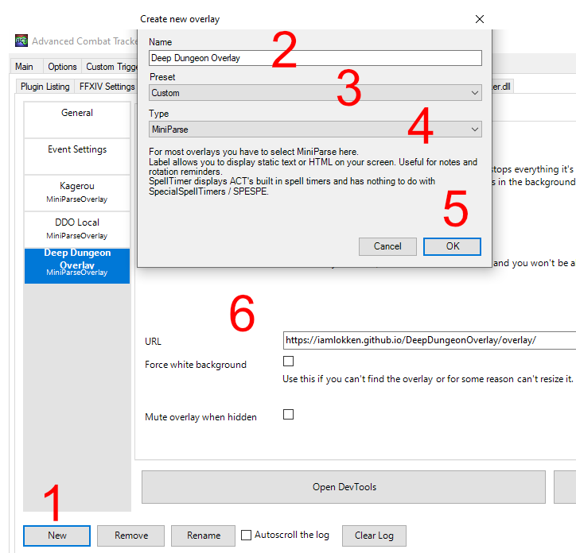

# Bermerkung vor der Installation

Die Option _Hide Chat Log (for privacy)_ des FFXIV ACT Plugins darf nicht aktiviert werden, da das Overlay einige ausgewählte Logzeilen lesen muss, um zu funktionieren.

Dies befindet sich im "FFXIV Settings"-Tab unter "Options".

# Overlay installieren

1. Erstelle über die Schaltfläche "New" ein neues Overlay im "OverlayPlugin"-Tab.
2. Gebe dem Overlay einen beliebigen Namen.
3. Wähle "Custom" aus der "Preset"-Dropdown-Liste.
4. Wähle "MiniParse" aus der "Type"-Dropdown-Liste.
5. Klicke auf "OK".
6. Füge bei "URL" folgenden Link ein: https://iamlokken.github.io/DeepDungeonOverlay/overlay/

	
	
- Nach der Erstinstallation wird empfohlen die Größe des Overlays wie folgt anzupassen, damit die Größe je nach ausgewähltem Gegner ausreichend ist. Natürlich kannst du die Größe auch nach deinem Belieben anpassen.
	- Kreuze "Force white background" im "OverlayPlugin"-Tab direkt unter der URL an.
	- Ändere die Größe des Fensters, um ungefähr dem Verhältnis des Bildes unten zu entsprechen.
	- Entferne dein Kreuz bei "Force white background".

	
	
	
	 
	
	Die Installation ist abgeschlossen.
	
	Zurück zur [README](../../../README.md)
