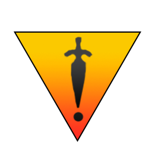

# Einleitung

Deep Dungeon Overlay ist ein OverlayPlugin-Skin in Entwicklung, das dir Echtzeitinformationen während Sololäufen in den Tiefen Gewölben von FFXIV gibt.

| |  |
| :-: | :-: |
| |  |

# Voraussetzungen um DDO nutzen zu können

DDO erfordert Advanced Combat Tracker ([ACT](https://advancedcombattracker.com/)). Zusätzlich erfordert DDO, dass die Plugins [FFXIV_ACT_Plugin](https://github.com/ravahn/FFXIV_ACT_Plugin) und [OverlayPlugin](https://github.com/ngld/OverlayPlugin) in ACT installiert sind.

Eine schriftliche Anleitung zur Installation von ACT und FFXIV_ACT_Plugin kann hier eingesehen werden: [ACT installieren](https://github.com/FFXIV-ACT/setup-guide)

Zusätzlich hat Desperius FFXIV eine gute Videoanleitung erstellt: [Videoanleitung](https://www.youtube.com/watch?v=urZTrF864x8&t=0s)

# Installation des DDO

Siehe [Installationsanleitung](INSTALL_DE.md).

# Einrichtung für Streamer

Siehe [Anweisungen](STREAMER.md) zur Einrichtung für Streamer.

# Aktuelle Features

* Punktzahl (Schätzung)
	* Das Overlay wird dir eine Echtzeitschätzung deines Punktestands geben. Siehe [Details zur Punkteberechnung](https://github.com/IAmLokken/DeepDungeonOverlay/blob/main/overlay/docs/de/README_DE.md#details-zur-punkteberechnung) für mehr Informationen.
	* Der Algorithmus zur Punkteberechnung basiert auf Alphas Nachforschungen: [Erklärung zur Punkteberechnung](https://docs.google.com/document/d/1MnR2Xtj2lol1LESgscI6yi_1xcAeP3FBwJecbD-EiwE/edit)
	 
* Tongefäße:
	* Tongefäß des Siegelbruchs (Aktiviert, wenn eins auf der aktuellen Ebene benutzt wurde)
	* Tongefäß der Sicht (Aktiviert, wenn eins auf der aktuellen Ebene benutzt wurde)
	* Tongefäß der Schätze (Aktiviert, wenn eins auf der vorherigen Ebene benutzt wurde und nun aktiv ist)
	* Tongefäß der Feindwandlung (Aktiviert, wenn eins auf der vorherigen Ebene benutzt wurde und nun aktiv ist)
	* Tongefäß des Feindtods (Aktiviert, wenn eins auf der vorherigen Ebene benutzt wurde und nun aktiv ist)

* Statistiken:
	* Besiegte Gegner
	* Besiegte Mimiks (Korrigane)
	* Ausgelöste Fallen 
	* Geöffnete Schatztruhen
	* Erhaltene Ebeneneffekte (Enthexung zu benutzen, wird die Anzahl verringern)
	* Seltene Monster (Nur in PotD)
	* Ebenensätze in 30 Minuten oder weniger abgeschlossen
	
* Informationen zum Bestiarium:
  * Name des Gegners
	* Prozentuale Lebenspunkteanzeige des Gegners
	* Gefahrenstufe des Gegners:
		Einfach | Vorsicht | Gefährlich | Unmöglich
		:-: | :-: | :-: | :-: 
		 |  |  | 
	* Aggrotypen der Gegner:	
		Sichtfeld | Geräusch | Näherung
		:-: | :-: | :-:
		 |  | 
	* Gegnerinformationen (Dinge, die man über den Gegner wissen sollte, falls relevant).
	* __Alle Informationen zum Bestiarium sind mit Erlaubnis Maygis Handbuch zu den Tiefen Gewölben entnommen worden.__.
	 	* Folge Maygi auf [Twitch](https://www.twitch.tv/maygii), [Twitter](https://twitter.com/MaybeMaygi) und [Youtube](https://www.youtube.com/c/Maygi).
		* [PotD Handbuch](https://docs.google.com/document/d/e/2PACX-1vQpzFuhmSwTXuZSmtnKLNgQ0nRhumCFaB8NvCXFXSjrBHPRT5lXY8jMR4RaCK1aNfcl_G5ph5DNNwfl/pub)
		* [HoH Handbuch](https://docs.google.com/document/d/1YVBSTOgJO-xOAB6YyKZEZRikjXFPle6Ihf_E7VdmQnI/edit)
		* Weitere Aggrotypen von Gegnern wurden mit Hilfe von Cloudbursts Status-Spreadsheets getestet. [PotD](https://docs.google.com/spreadsheets/d/1nKI0-AApj-aiuUimrPkuQUJaa4DU8Ox7KqdC_ibme8E/edit#gid=12879293), [HoH](https://docs.google.com/spreadsheets/d/1aDlsiN3At6Fvfj_gg5weucDYqjQawQxGHFhJvzEUrek/edit#gid=375717345)
	* **BEACHTE**: Das Bestiarium ist die einzig verfügbare Kategorie in Gruppenläufen.
	* **BEACHTE**: Falls ein Eintrag im Bestiarium fehlen oder inkorrekt sein sollte, bitte [lege ein neues Issue an](https://github.com/IAmLokken/DeepDungeonOverlay/issues).

Die Punktzahl, Tongefäße, Statistiken und Bestiarium des Overlays können mit den Checkboxen in der Titelleiste ein- bzw. ausgeblendet werden.

 

# Gespeicherte Informationen

DDO speichert alle relevanten Informationen zum aktuellen Lauf in der OverlayPlugin Config-Datei.

Wenn du Läufe verfolgen und speichern willst, gibt es ein paar Vorbehalte zu beachten:
* DDO kann, sobald man die Tiefen Gewölbe verlassen, FFXIV oder ACT geschlossen hat, keine identischen Speicherdaten mehr unterscheiden.
* Zwei Speicherdaten sind identisch, falls:
	* Beide zu den gleichen Tiefen Gewölben gehören.
	* Beide zu dem gleichen Charakter gehören.
	* Beide mit dem gleichen Job bestritten werden. 
	* Beide auf der gleichen Ebene sind.

Ein Fallbeispiel wäre, dass du zwei Speicherdaten zur gleichen Ebene spielst, d.h. beispielsweise zwei Speicherstände auf Ebene 171 als RDM auf dem gleichen Charakter. 
Wenn du im Spiel einen Speicherstand auswählst, hat das Overlay keine Möglichkeiten nachzuvollziehen _welchen_ Speicherstand du angeklickst hast und wird einfach den ersten nehmen, der in der eigenen Speicherdatei via Tiefes Gewölbe, Charakter, Job und Ebene gefunden wird. Da dort nun zwei Speicherstände gefunden werden, könnte das Overlay den falschen Eintrag auswählen und deine Daten wären verfälscht.
Dies passiert nur, falls du das Tiefe Gewölbe verlässt, während beide Speicherdaten auf der gleichen Ebene sind. Falls du einen Speicherstand weiter spielst als den anderen, wird das Overlay keine Probleme haben.

Da das Overlay nicht mitbekommt wenn du einen Speicherstand löschst, gibt es zwei Schaltflächen, um die gespeicherten Informationen des Overlays zu löschen. Dies ist sinnvoll, falls du planst einen Lauf zu starten, der korrekt verfolgt werden soll. 

# Details zur Punkteberechnung

Die Schätzung des Punktestands nimmt vorausschauend einige Dinge an, damit die Punktzahl so akkurat wie möglich angezeigt wird:
* Deine Padjal-Ausrüstung ist maximiert (99/99).
* Deine Erfahrungsstufe ist maximiert (60/70).
* Du wirst den Lauf erfolgreich bis zur nächsten Ergebniskarte (30/100/200) abschließen.
	
Der Speedrun-Bonus wird am Anfang eines Ebenensatzes angerechnet und abgezogen sobald die "noch 30 Minuten Zeit"-Nachricht erkannt wird.

Sofern die "Gehe von vollständiger Aufdeckung der Karte aus"-Option aktiviert ist, wird am Anfang einer Ebene die volle Punktzahl dafür angerechnet.

Sofern die "Gehe von vollständiger Aufdeckung der Karte aus"-Option deaktiviert ist, wird am Anfang einer Ebene eine geschätze Punktzahl, basierend auf das Tiefe Gewölbe und der Ebene, dafür angerechnet, außer:
* Ein Tongefäß der Sicht wurde benutzt. Volle Punktzahl wird angerechnet.
* Die Gesamtmenge aufgedeckter Räume entspricht der maximal möglichen Anzahl an Räumen für das aktuelle Tiefe Gewölbe und Ebene. Volle Punktzahl wird angerechnet.
* Die Gesamtmenge aufgedeckter Räume ist kleiner als die minimale Anzahl an Räumen für das aktuelle Tiefe Gewölbe und Ebene. Keine Punkte werden angerechnet.

Zaubersteine können Monster töten, die so weit vom Spieler entfernt sind, dass dessen Computer diese nicht geladen hat. Das bedeutet, dass für deren Tod keine Todesbenachrichtigung erhalten werden kann und daraus resultiert, dass die Anzahl besiegter Monster verfälscht sein wird.

Die Punktzahl "414" wird angezeigt, falls der Lauf nicht auf Ebene 1, sondern auf 21 (HoH), bzw. 51 (PotD) gestartet wurde.
