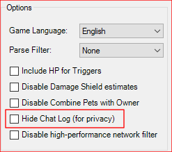

# インストールする前に

このプラグインを使用するために色々な詳細を読む必要がありますからHide Chat Log (for privacy)というFFXIV ACTのプラグインオプションはオンにできません。

*FFXIV Settings*の中にあって、*Options*の部分にあります。

# Overlayをインストールする方法

1. OverlayPluginのメニューの中で、'New'のボタンを押す。
2. Overlayの名前を設定してください。なんでも大丈夫です。
3. Presetのメニューの中で、'Custom'を選択してください。
4. Typeのメニューの中で、'Miniparse'を選択してください。
5. OKを押す。
6. この[URL]に設定してください。
	* https://iamlokken.github.io/DeepDungeonOverlay/overlay/ (DDO)
	* https://iamlokken.github.io/DeepDungeonOverlay/overlay/targetinfo/ (DDTI)

	
	
- インストールした後で、プラグインのサイズを変更することはおすすめです。しかし、お好み設定に変更するのは大丈夫です。
	- OverlayPluginの中で、URLの設定下にある'Force white background'を選択してください。
	- 以下の画面と大体同じようなサイズに変更してください。
	- 'Force white background'を選択解除してください。

	
	
	
	 
	
	インストールの完了
	
	[README](../../../README.md)に戻る
  
  [Chiela](https://twitter.com/certa)による翻訳しました。
